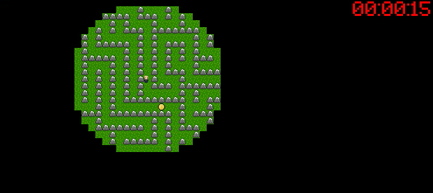

# Grupo
[Matheus Stutzel](https://github.com/matheusstutzel/reativos), [Rodrigo Braga](https://github.com/rbs758/reativos)

# Projeto
Fazer um jogo de labirinto no computador, que fosse controlado pelo arduino e tivesse um elemento de interatividade com o ambiente.

# Componentes
Arduino
Tela com botões
Sensor de luminosidade

# Linguagem
Arduino - Ceu
Computador - C com SDL

# Detalhes do projeto
O jogador deve procurar 5 moedas em um labirinto com a visibilidade reduzida. O jogador pode aumentar a visibilidade ao iluminar o sensor de luminosidade no arduino, porem ao fazer isso a sua energia é reduzida. Se a energia acabar, a visibilidade é reduzida até que a energia seja recarregada. O jogo acaba quando forem encontradas as 5 moedas escondidas no labirinto.

# Vídeo

# Imagens

Jogo com a visibilidade normal

Jogo com a visibilidade reduzida

Objetivo do jogo é recolher todas as moeda
